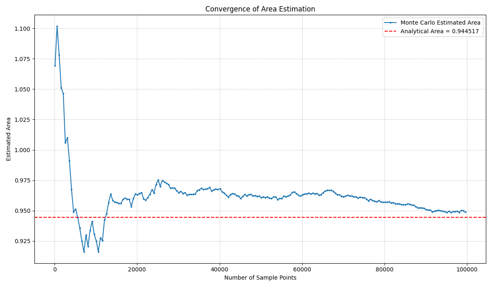
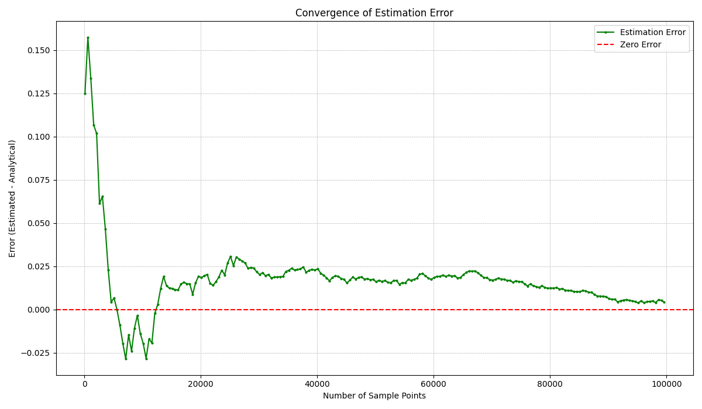

# Задача А1

**Колобанов Никита Дмитриевич. 248. Set 3.**

- Класс кругов и функцию содержания в круге точки я реализовал в «Circle.h» и «Circle.cpp».
- Сам алгоритм Монте-Карло для подсчета площади я реализовал в «itersArea.cpp» и «utils.h», не уточняя какую площадь использовать.
- Файл «main.cpp» был использован для генерации «results.csv» использовав первый вариант, широкой площади.
- После я создал файл «plot_results.py» для генерации двух файлов из assets с графиками.

1.  **График первого типа, которые отображают, как меняется приближенное значение площади в зависимости от указанных параметров алгоритма:**

    

2.  **График второго типа, которые отображают, как меняется величина относительного отклонения приближенного значения площади от ее точной оценки в зависимости от указанных параметров алгоритма.**

    

-   Для сдачи задачи A1i в CodeForces я объединил все в файл «A1i.cpp» и отправил на полный бал посылкой №349168433.
-   Все результаты и исходный код я приложил в GitHub репозиторий [https://github.com/nikkol615/hse-se2-algo-set3-A1](https://github.com/nikkol615/hse-se2-algo-set3-A1)